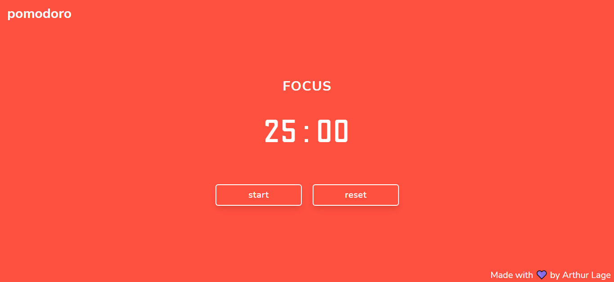
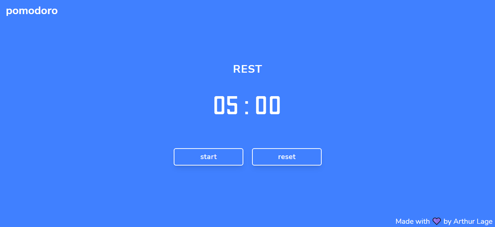
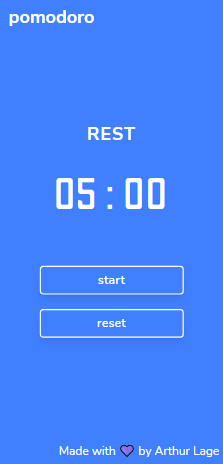
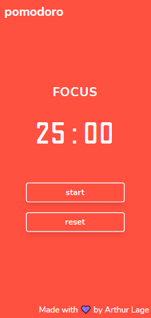

# POMODORO TIMER

## ✉ About

A pomodoro timer made with React, Typescript and TailwindCSS.
The Pomodoro technique is based on having 25 minutes focused in studying, work or other activities and then a 5-minute break

## 🌆 Images






## Extra Credits

Clock Alarm Sound from: https://orangefreesounds.com/

## ⚠ Requirements

In order to run the project, you will need:

- Node
- A web browser (Chrome, Firefox, Edge, etc...)

## 💻 Technologies Used

### FRONTEND

- HTML
- CSS
- JavaScript
- ReactJS
- Typescript
- TailwindCSS

### EDITOR

- Visual Studio Code

## ⬇ How to download the project

```bash

git clone https://github.com/arthur-lage/pomodoro.git

cd pomodoro

npm install

npm run dev

```

## 🔗 How to use the app

If you wish to test the application, click the link below:

[Pomodoro](https://pomodoro-al.vercel.app/)
